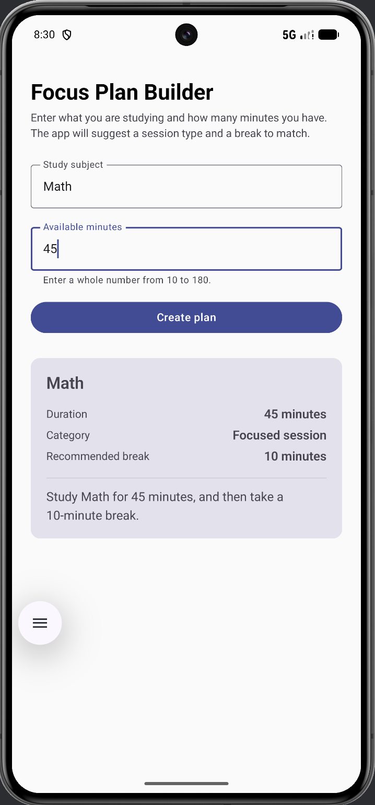

# Focus Plan Builder

**Name:** Aayush Kumar
**Assignment:** Coding Assignment 2, Focus Plan Builder
**Package:** `io.github.aayushhks.focusplanbuilder`

## Description

A single screen Android app that turns a study subject and the time you have
into a study plan. You type what you are studying and how many minutes are
available. Once both values are valid the Create plan button turns on, and
tapping it shows a card with the subject, the length of the session, a category,
a recommended break, and a summary sentence.

Durations go from 10 to 180 minutes. Anything shorter, longer, not a number, or
empty leaves the button off, and the app does not crash on bad input.

| Duration | Category | Break |
|---|---|---|
| 10 to 29 minutes | Quick review | 5 minutes |
| 30 to 60 minutes | Focused session | 10 minutes |
| 61 to 180 minutes | Extended session | 15 minutes |

Written in Kotlin with Jetpack Compose and Material 3. No XML layouts, Views or
Fragments.

## Running it

1. Open the `Practice_2` folder in Android Studio.
2. Wait for the Gradle sync to finish.
3. Start an emulator from Device Manager. I used Medium Phone, API 36.
4. Press Run, or from a terminal inside the project folder:

```bash
./gradlew installDebug
adb shell am start -n io.github.aayushhks.focusplanbuilder/.MainActivity
```

## Screenshot



## State and recomposition

**Which composable owns the application state?** `FocusPlanRoute` owns it. It
holds `subject`, `minutesText` and `plan`, does the validation, and passes the
values and callbacks down to `FocusPlanScreen`. That screen holds no state of its
own and only draws what it is given.

**Why are the text field values stored as String rather than Int?** An
`OutlinedTextField` hands back exactly what the user typed, which can be an empty
field or a number that is still half typed. An `Int` cannot hold `""`, so I keep
the raw `String` and convert it only when I actually need a number.

**Why is toIntOrNull() safer than toInt() here?** `toInt()` throws a
`NumberFormatException` on anything that is not a number, so typing `abc` or
clearing the field would crash the app. `toIntOrNull()` returns `null` instead,
and my validation treats `null` as invalid.

**What state change causes the button to be recomposed?** `canCreatePlan` is
worked out from `subject` and `minutesText` instead of being stored on its own.
Editing either field writes to its `MutableState`, Compose sees that the button
read that value, and the button recomposes with a new `enabled` value.

**What does rememberSaveable preserve that a local variable would not?** A plain
variable resets on every recomposition, and `remember` survives recomposition but
not the Activity being recreated. `rememberSaveable` saves to the instance state
bundle, so both text fields are still filled in after the emulator rotates.